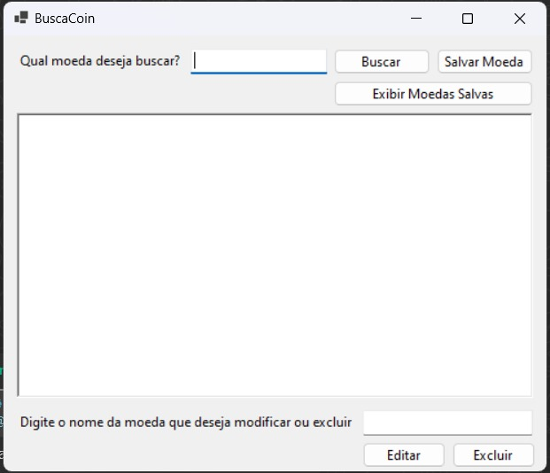

<!-- Improved compatibility of back to top link -->
<a name="top"></a>

<!-- TABLE OF CONTENTS -->
<details>
  <summary>Sumário</summary>
  <ol>
    <li>
      <a href="#about-the-project">Sobre o projeto</a>
      <ul>
        <li><a href="#built-with">Construído com</a></li>
      </ul>
    </li>
    <li>
      <a href="#getting-started">Começando</a>
      <ul>
        <li><a href="#prerequisites">Pré-requisitos</a></li>
        <li><a href="#installation">Instalação</a></li>
      </ul>
    </li>
  </ol>
</details>

<!-- ABOUT THE PROJECT -->
## Sobre o projeto

<p>Este projeto se trata de uma aplicação desktop inovadora que permite aos usuários pesquisar e obter informações detalhadas sobre criptomoedas. Desenvolvido com foco em simplicidade e eficiência, nosso software oferece uma interface intuitiva que torna a navegação e a busca de dados rápida e direta. Com esta ferramenta, tanto investidores experientes quanto novatos podem acessar facilmente informações cruciais para tomar decisões informadas no mercado de criptomoedas.</p>

<p align="right">(<a href="#top">Voltar ao topo</a>)</p>

### Construído com

   

<p align="right">(<a href="#top">Voltar ao topo</a>)</p>

<!-- GETTING STARTED -->
## Começando

Se quiser baixar o projeto e executá-lo localmente, tem que obedecer os pré-requisitos e seguir corretamente as instruções passo a passo !

### Pré-requisitos

Vá para o site "https://dotnet.microsoft.com/pt-br/" e instale o <strong>.NET</strong>. <br> Em seguida, abra o terminal e digite o seguinte comando para verificar se a instalação foi concluída corretamente.
  ```sh
  dotnet --version
  ```
(Você deverá ver algo parecido com: "8.0.303") <br> <br> 

Vá para o site "https://www.git-scm.com/" e instale o <strong>Git</strong>. <br> Em seguida, abra o terminal e digite o seguinte comando para verificar se a instalação foi concluída corretamente.
  ```sh
  git --version
  ```
(Você deverá ver algo parecido com: "git version 2.45.2.windows.1")

### Instalação

1. Abra o terminal e digite o seguinte comando.
    ```sh
    cd Desktop 
    ```	
    (Em alguns computadores o diretório da área de trabalho fica em "cd Área de Trabalho" em outros ficará em "cd Desktop") <br> <br>
2. Clone o repositório
    ```sh	
    git clone https://github.com/onathanmateus/A3_Sistemas_Distribuidos.git
    ```
3. Entre no Repositório
    ```sh	
    cd A3_Sistemas_Distribuidos
    ```
4. Abra o repósitório com o <strong>Visual Studio Code</strong> (caso você não possua o <strong>Visual Studio Code</strong>, entre nesse site e baixe "https://code.visualstudio.com/")
    ```sh	
    code .
    ```
5. Tenha certeza de ter instalado a seguinte extensão no seu <strong>Visual Studio Code</strong>: "C# Dev Kit" <br> <br>
6. Em seguida clique na tecla "F5" do seu teclado e espere a aplicação abrir. (Se tudo ocorrer bem a aplicação irá abrir em um formato de janela pequena parecida com a foto a seguir) <br> <br>

<div align='center'></div> <br> <br>

Se tudo ocorrer bem fique a vontade para pesquisar por qualquer criptomoeda e veja a aplicação trazer informações sobre ela !! 

<p align="right">(<a href="#top">Voltar ao topo</a>)</p>
